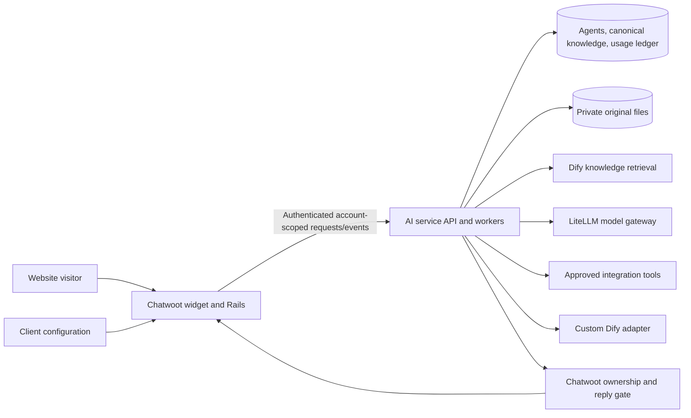

# Native AI Agents architecture

Status: implementation plan. The private Huly project CWAI holds deployment research and client-specific configuration. This document defines the source-controlled product and service contracts.

## Product boundary

Add native AI Agents, Knowledge, Integrations, and Usage & plan areas. Website chat is the first channel. Agents have editable identities, client-friendly behavior settings, reusable knowledge attachments, approved abilities, reply rules and guided business actions. Platform administrators maintain technical prompts, provider/model choices, integration connections and bespoke adapters.

Use Dify through its server-side Knowledge API for indexing and retrieval. Keep canonical editable knowledge, source files, revisions, disabled state and export under application control. Captain datasets/documents/scenarios are not dependencies. Product catalog indexing is owned by the commerce integration and is absent from the customer Knowledge library.

## Components

One service codebase runs API and durable worker processes. Chatwoot retains account membership, contact/inbox identity, transcripts and authoritative conversation ownership. The AI service handles agent configuration, knowledge/index mappings, integration bindings, execution jobs and usage events. Do not introduce a competing transcript store.

The Vue UI calls account-authorized Rails endpoints. Rails forwards scoped credentials carrying account, actor, audience and permitted action. All relationships validate account ownership. Browser IDs, model arguments, retrieved text and page events never establish tenant authority.

## Agent configuration and execution

An agent version contains identity, inbox bindings, behavior settings, prompt version, retrieval profile, attached bases, enabled abilities, reply rules, guided actions, handoff policy and runtime adapter. Clients save drafts, test and publish; runs record the published version. Agent pause and knowledge disabling take effect immediately.

For standard agents, the service receives authenticated events into a durable inbox, deduplicates logical messages, selects the enabled inbox agent, checks ownership/allowance, evaluates applicable rules, and executes a bounded model/tool loop through LiteLLM. Tool definitions are registered once; each agent has explicit permitted operations and each account has its own connection credentials. Server code validates and executes model tool requests. Mandatory live lookups and business verification must complete before protected facts are returned.

Tone and answer-length settings become prompt instructions. Exact replies use approved rules. Quote/order/handoff steps use guided-action state with validated required fields. Tool permissions, disclosure restrictions, ownership and quotas are enforced server-side. A custom Dify app/workflow adapter remains available to administrators, with explicit guarantees about which native controls it supports.

A run returns a structured bundle of text, source/product/action IDs and optional handoff. Render cards and buttons from validated tool/configuration data. Citation IDs must belong to the retrieved set and current enabled revisions. Private documents use authorized previews.

## Canonical knowledge

Use account-owned KnowledgeBase, Source/SourceRevision, KnowledgeEntry/EntryRevision, AgentKnowledgeBase and IndexBinding/IndexJob records. Preserve exact manual/CSV Q&A text. Store generated content as grounded drafts with provenance and review state. Original files and extracted text remain available for export and rebuild.

A logical knowledge base may use multiple physical Dify indexes for FAQ and contextual document retrieval. Map entries/sources by stable IDs and revision, not names. On disable, filter canonical IDs immediately, invalidate caches and reject answers based on revoked content; mirror the update to Dify through durable jobs. Display Ready only after confirmed indexing.

Portable export includes FAQ CSV, enabled/disabled state, source provenance, original files and a manifest. Credentials, private conversations and managed commerce catalog indexes are excluded. Test round-trip import/export and index restoration.

## Ownership

Track AI ownership separately from Chatwoot status: ai_active, human_waiting, human_active, paused. Queue/team routing may enter human_waiting, where the AI continues helping if configured. Explicit Take over and the first public human reply enter human_active immediately. Private notes do not. Return to AI is explicit.

Chatwoot stores an incrementing ownership version. Each run captures it. The reply commit endpoint checks current ownership/version, account/inbox/agent authority, source validity, deduplication and quota reservation under the same conversation lock used by takeover. Stale outputs are rejected. One active public speaking agent/runtime is permitted per conversation.

## Usage and manual plans

One AI conversation is a fixed 24-hour window for a trusted visitor identity within one account, beginning with the first qualifying successfully published assistant reply after engagement. Replies across threads/agents/inboxes share that unit until expiry. Idle expiry alone creates no charge. Exclude unengaged nudges, tests, duplicates and failed/cancelled replies before publication.

Store immutable usage events, reservations, window boundaries, policy version, plan cycle and audited adjustments. Serialize identity-window and quota reservations transactionally. Delivery crosses service/Chatwoot databases; use acknowledgements/outbox reconciliation to finalize a reply once after a crash. Assign a window to the cycle where it starts. Anonymous cross-device identity cannot be guaranteed.

Start with manually assigned plans, included allowances, renewal dates and overrides. Show usage preview before enforcement. Existing windows continue at quota; new windows safely enter the human queue. Bound tokens/tool work/ingestion as well as conversation counts. Future payment reporting consumes the ledger asynchronously and never becomes the runtime quota authority.

## Delivery sequence

1. Preserve the customized upstream baseline and prove lab parity.
2. Canonical knowledge adapter, manual FAQs, CSV, disable/edit/export.
3. Agent configuration/versioning and shadow usage/manual plans.
4. Runtime, ownership gate, scoped commerce and structured citations/cards; one-inbox pilot.
5. Document extraction/OCR/generated FAQ review and quota enforcement.
6. Guided actions, custom adapters/approved HTTP MCP, controlled nudges/follow-ups.
7. Session-interest/specialist routing, expanded diagnostics; payments and further channels later.

Each phase has account/inbox feature flags. Lab credentials, datasets and stores are isolated. Shadow mode suppresses public delivery, write-capable tools and customer allowance usage. Promotion gates cover source/variant correctness, account isolation, takeover races, duplicate delivery, exact usage boundaries, migrations and rollback. Keep the old runtime available but inactive during the new runtime's pilot.
